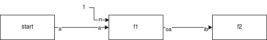

# Choregrapher Node for NodeJS

Choregrapher is a lib to easily build distributed computing graph. 

## Features

- Choregraphies are described using plain JS objects or using JSON object.
It use Mongo DB as database for the choregraphies, storing the results of the processes or as object storages. The choregraphies can be stored and loaded in the database.
- Graph nodes can:
  - have multiple inputs and multiple outputs
- all processes steps are saved in database

## Examples
### Running the examples 
#### Installing prerequisities

This project depends on external dependencies not aviaible on NPM: @djedi/configuration, @djedi/log, @djedi/event-sourcing, @djedi/object-storage.

This libs are on github. To install them do:
``` shell
git clone https://github.com/djedi23/djedi-configuration.git
cd djedi-configuration
yarn link .
```
then in the project, run 
``` shell
yarn link @djedi/configuration
```

#### Build the project:
```shell
yarn
yarn build
```
#### Run an example
```shell
LOG__LEVEL=silly node ./build/examples/basic
```

### Basic

This examples is adapted from `exmaples/basic.ts`.
It implements this graph:



The code starts by implementing 2 functions `node1_function`and `node2_function`. They will be associated to a graph node. Their signatures are `(input:Input)=>Ourput`.

For example, the function `node1_function` will be associated to the node `f1`.   `node1_function` is `({a:number, n:number}) => ({oa:number})`.

Next, we find the graph definition. It's an object with:
- an `id`;
- `nodes` definitions;
- nodes relations definitions.

Once the graph declared, register the graph in the system. Once registered, the graph waits for new data.

The next line injects data in the graph with `startProcess`.

``` typescript
import { addGraph, Graph, Node, startProcess } from '../';
const node1_function = ({ a, n = 1 }) => ({ oa: a * n });
const node2_function = ({ ib }) => logger.info(`Result is: ${ib}`);
const graph = {
  id: 'graph1',
  nodes: [{ id: 'f1', fct: node1_function, input: ['a', 'n'], output: ['oa'] }, 
          { id: 'f2', fct: node2_function, input: ['ib'] }],
  edges: [
    {
      from: { node: 'start', output: 'a' },
      to: { node: 'f1', input: 'a' },
    },
    {
      from: { node: 'f1', output: 'oa' },
      to: { node: 'f2', input: 'ib' },
    },
  ],
}
addGraph(graph);
startProcess(graph, { a: 2 }, { context: { f1: { n: 2 } } });
```

## Configuration

Configuration can be set in three points:
- `config/config.json` file. `log:level` becomes `{"log":{"level":"silly"}}`;
- environment variables. `log:level` becomes `LOG__LEVEL`;
- CLI arguments. `log:level` becomes `--log-level`.

| config                         | description                                               | Default          |
| ------------------------------ | --------------------------------------------------------- | ---------------- |
| daemon                         | Wait for data. Don't inject default values in the process |                  |
| application:name               |                                                           |                  |
| application:releasenumber      | Release number of the application                         |                  |
| application:gittag             | Git tag                                                   |                  |
| application:gitbranch          | Git current branch                                        |                  |
| db:database                    | name of the database                                      |                  |
| mongodb:url                    | URL of the database                                       |                  |
| storage:connection             | URL of the storage: mongo gridfs or minio                 |                  |
| storage:bucket                 | Storage bucket name                                       |                  |
| log:level                      | log level                                                 |                  |
| log:dir                        | log directory for files logging                           |                  |
| log:datePattern                | File format date pattern                                  |                  |
| log:zippedArchive              | File gzipped                                              |                  |
| log:maxFiles                   | Max number of files when rotating                         |                  |
| log:maxSize                    | Max size of file before rotating                          |                  |
| log:logstash:disabled          | when true, explicit disable logstash log                  |                  |
| log:logstash:host              | logstash http host                                        |                  |
| log:logstash:port              | logstash http port                                        |                  |
| log:logstash:path              | logstash http path                                        |                  |
| log:logstash:auth              | logstash http  auth object                                |                  |
| log:logstash:ssl               | use ssl. True by default                                  |                  |
| log:sentry:disabled            | when true, explicit disable sentry log                    |                  |
| log:sentry:dsn                 | sentry dsn                                                |                  |
| log:sentry:level               | sentry log level                                          |                  |
| queue:url                      | Rabbitmq url.                                             | amqp://localhost |
| queue:prefetch                 | Number of event to prefetch.                              | 8                |
| queue:exchanges:events:name    | Prefix of the exchange.                                   | flow             |
| queue:queues:events:routingkey | Routing key prefix                                        | flow             |
| queue:queues:events:name       | Queues prefix                                             | flow_queue       |
